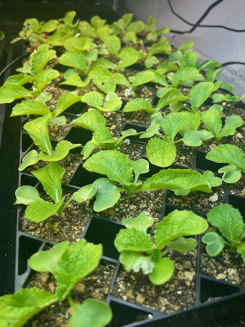
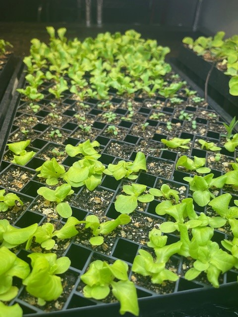
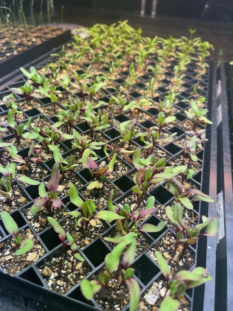
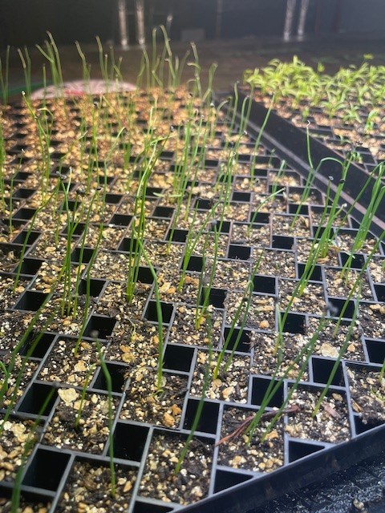

---
# Title, summary, and page position.
linktitle: Update post of initial spring veggies
summary: Updating the journal.
weight: #3
# Page metadata.
title: Update post of initial spring veggies 🍃
date: '2024-03-06'
#type: blog # Do not modify.
lastmod: '2024-03-06'
show_date: true
share: true

---

Date of pics are 3/04/24 in Zone 7b. Todays temps are high 50s. 

Here are the latest progress of the lettuce, napa, carrots, onions, beets.

Plan on starting the summer veggies in this weekend. Space is limited underneath the grow lights, only have room for 4 trays. Need more light!

