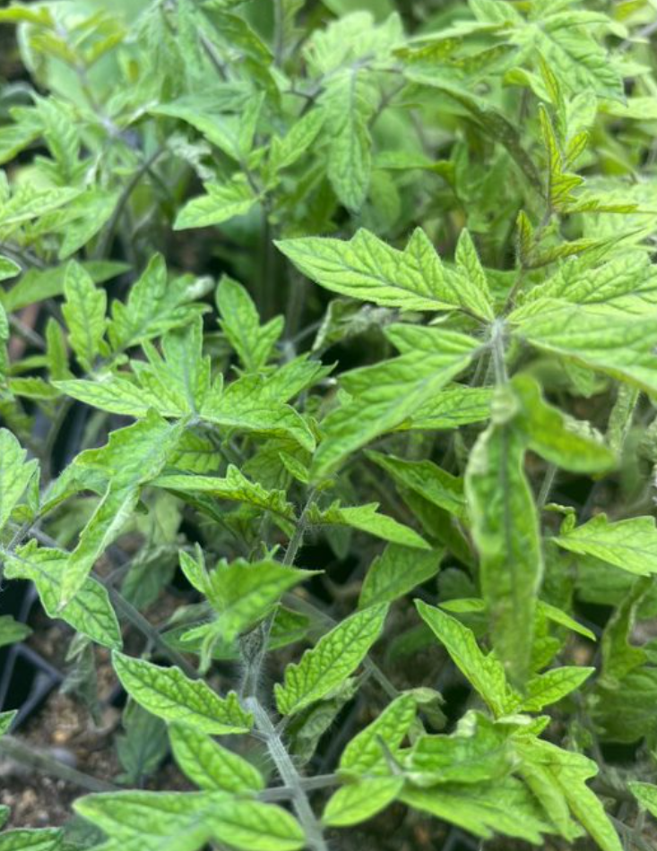
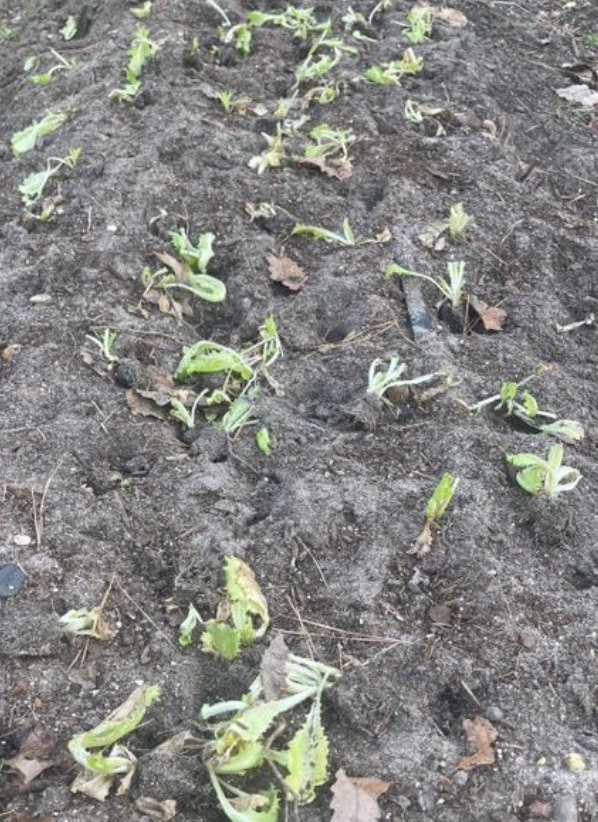
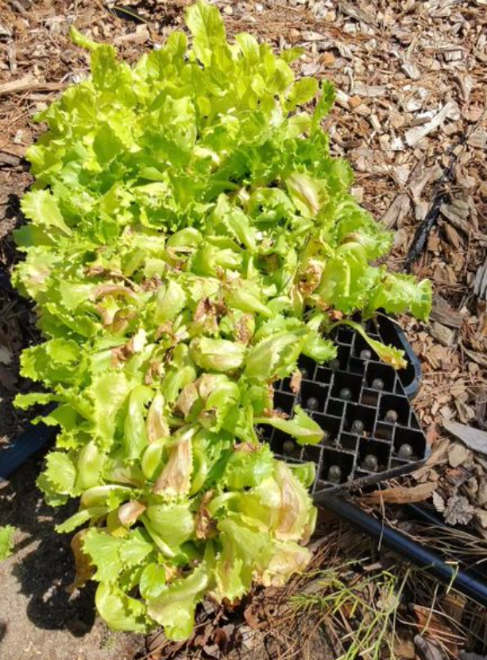

---
# Title, summary, and page position.
linktitle: Post 3, almost time for migration
summary: Updating the journal.
weight: #4
# Page metadata.
title: Post 3, almost time for migration 🍃
date: '2024-04-16'
#type: blog # Do not modify.
lastmod: '2024-04-16'
show_date: true
share: true

---

Pics are from 4/10/24 in Zone 7b. Todays temps are in the 70s. 

Learn a few things these weeks.

Purple leaves on young tomato plants are a non-issue. Used 4-5 grams of 20-20-20 general peters fertilizer mixed into 1 gallon of water. After a few days, the tomato plants recovered and most of all leaves returned to green!

Deer are out an about in beginning of April. After transplanting the lettuce, the follow day, no more....

Lettuce only need 30-45 days in a 128 cell tray. Any longer they will bunch up. The same with carrots. 

Plan on starting the summer veggies in this weekend. Space is limited underneath the grow lights, only have room for 4 trays. Need more light!

