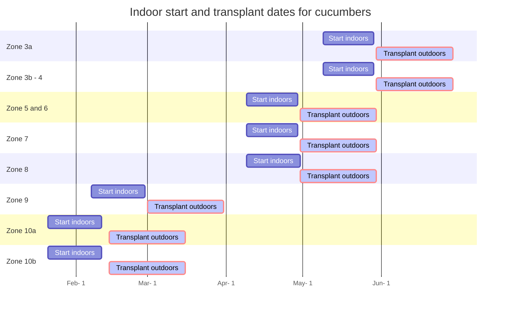

---

# Documentation: https://hugoblox.com/docs/managing-content/
title: "Cucumbers 🥒"
summary: "Guide to growing cucumbers in the backyard"
toc: false
date: '2024-02-24T00:00:00Z'
lastmod: '2024-2-10'
show_date: true
share: true
tags: [vegetables]
---


#### 📣 At a glance

```markmap {height="300px"}
- 🍅**Tomato plants**
  - 🌞 **Sun** Full 
  - 🌧️ **Water** Every other day, if leaves
      are wilting = add water
  - 🥫 **Fertilize** Weekly with 20-20-20 at 
          ~150-200 ppm at full size, or utilize fertilizer 
          calculator below 
  - 🧪 **PH** 6.0 to 6.8
  - 📏 **Spacing** at least 1.5-2 Feet between cucumber plant
  - 🧹 **Maintenance** Trellis and guide vines to safe position,
            harvest cucumbers at picking size which avoids plant
            deterioration

```



---

##  Introduction
{}
Cucumbers are what I consider a foundation vegetable like tomatoes. They make wonderful side dishes to go with meats, simple addition to salads, and make good for juicing. Cucumber plants may yield 20-25 lbs per plant annually. The cucumber types I have grown successfully are called Unagi, marketmore, and Gershin. Unagi is a long style cucumber with thin skin, the kind similar at BJs/Costco/Sams but taste much better when home grown. Marketmore is a thicker cucumber with thicker skin allowing for longer storage. The Gershin cucumber is a pickling cucumber, short, and stocky. Makes for excellent pickles for sandwiches and burgers.  

Cucumbers can range in length from 3 inches to over 13 inches, vary by sweetness/bitterness, and harvesting . 


This guide will provide an overview of how to grow cucumbers.
{}


---

## Starting 🏁

First step, determine your Zone. [Click here to access the zone map 🗺](/docs/zones/) or click the link on the left to access zone information. The dates below are mere guidelines as to the best time of year to start cucumber seeds. If seeds are started indoors too early, may outgrow the space and lighting available to continue growth in larger containers. If started too late, may not have enough time to obtain successful yields due to weather cooling or the young plants may not manage well under the hot summer sun.  


### Guidelines for start dates




### Sizing
Cucumber seeds should be started in 32 or 50 count trays. A tray is roughly about  21¼" x 11¼" x 2¼" or 19.6" x 9.75". Each cell within this tray has dimensions: 1¾" x 1¾-2.72". 32 inch size tray are typically around 2" inch square. This will provide each cucumber seedling with ~3-4 weeks of growth. Also, try not to plant cucumber seeds in smaller containers. They will out grow the space quickly which would requiring transferring the young seedlings to larger size pots. More handling of the young fragile seedlings = greater risk of damage, resulting in slow wilt, then eventual trip to the compost bin.


### Soil and seeding
Utilize potting soil that can be purchased from major retailers like lowes/home depot/walmart/aldis/target. The bagged soil should be labeled potting soil. Potting soil is most suitable for seed germination due to its drainage capacity. Bags labeled garden soil or dirt will not allow good drainage in containers. Water drainage in containers are required to prevent water stagnation. Stagnated water can eventually suffocate and rot plant roots.

Within each cell/container plant a single cucumber seed. If you only have a few containers and many seeds,  go ahead and plant 2 seeds per small container. If/When all the seeds sprout, cut the extra weaker looking seedlings and leave a single plant to continue to grow. 

During this stage, ensure the top soil area is kept moist. Use a spray bottle to water the top or gently pour water being careful not to wash away the seeds and disrupt the soil. A plastic dome works well in keeping a moist environment.

A heating mat is recommended. Temperatures around 75-80 helps with speeding up germination, otherwise lower temps in the 60s will prolong it. Light is also not as important for germination at this stage. However, a strong light source IS required as soon as the seeds sprout. Without a suitable light source that provides what plants require, will result in leggy stretched seedlings. From my experience, leggy/stretched seedlings eventually tip over and wither. 





{}

During this stage, not much excitement. I typically check the soil moisture first thing in the morning and again in the evening. If its a little dry, I use the misting bottle to reapply water. Sprouting can happen within a week or less using a heat mat. 

{}


-----
## Seedling stage
When the plant first emerges from seed, the first leaves are called 'false' leaves known as Cotyledons.  The picture below is about 18 days from initial planting of the cucumber seed: 




The young plant will continue to grow and produce 'true' leaves. See below of true leaves of cucumber plants. The is how fast they can grow after ~3 weeks:





During this time, it is recommended to provide 14-16 hours of light. Keep with watering via bottom tray such that soil is moist and not overly saturated. If watering with no bottom access, simply pour water carefully without disturbing the soil. Fertilize at this stage by applying 50 PPM of general fertilizer 20-20-20 once a week [^1]

---


## Transferring and Maintenance

❄️ ⛄ Before transplanting, ensure the dangers of **frost** are over and temperatures are consistently around 60 F degrees or higher. ⛄  ❄️

After about a month of growth, the cucumber plants will begin to look as pictured below. I simply kept with fertilizing, exposure to lights, and watering. At this stage, tomatoes may be prepped for transfer into the ground. 





{}
 If for some reason, planting needs to be delayed due to busy schedule, temperatures are colder than expected, raining for weeks, etc... the young plants can be transferred to larger pots for more growth and time.  

Below is a picture of some cucumber plants transferred to 4 inch pots. It was a cold/rainy spring in 2023 zone 7.




{}

 

💡 Prior to transferring the cucumber plants into the ground, ensure the cucumber plants are acclimated to sun exposure for at least a few days. Plants can be placed under direct ☀️ sunlight for 1-3 hours (start with less and gradually increase the time) and then returned under shade or back indoors. Pay attention to any changes. If the cucumber plants are wilting, check the soil moisture and return to under shade. However, if there are no signs of stress after a few days, they can be transplanted.


Plants should be spaced 1.5-2 feet apart. This spacing ensures adequate air flow and space for the cucumber plants to grow and produce. Continue to maintain watering and fertilizing.




### Fertilizing 💪

{}

I typically allow the cucumbers plants to grow for 5-6 months starting in April when they are transplanted. That is around 20-24 weeks of growth once they are in the ground. I divide the required fertilizer by the total weeks to get the weekly serving size. Fertilizing is real important for a healthy plants and consistent high quality cucumbers and yields.

{}


📚 <mark> **[According to Cornell University](http://nmsp.cals.cornell.edu/publications/files/VegetableGuidelines2019.pdf) the following rates are recommended for cucumber plants:** </mark> [^3]

For Nitrogen (N), (100 lbs) per acre. 

 
For Phosphorus (P)

| if current P levels are (lbs /acre)  |< 3       | 3-5  | 6-12  | 13-39         | 40+ | 
| ----------- | --------- | ------- | ------ |        --------- | ----| 
| **add P lbs per acre**      | 160   | 120       | 80      | 40    | 20       | 0 |

For Potassium (K)

| if current K levels are (lbs /acre)  |< 50       | 50-99  | 100-199  | 200-299         | 300+ | 
| ----------- | --------- | ------- | ------ |        --------- | ----| 
| **add K lbs per acre**      | 160   | 120       | 80      | 40    | 0       | 0 |

Taking average values for P and K we can use N 100 P 80 K 80 per acre (aka 43560 square feet).

 <mark> **Scaled down to a 100 SF garden, the values are:** </mark>

 - 0.23 lbs Nitrogen, 
 - 0.19 lbs Phosphorus, 
 - 0.19 lbs of Potassium.


Now that we know the weight required of each NPK value, now determine the amount of fertilizer equivalent. 

📚 <mark> **Utilize this tool and input your fertilizer and  NPK values required (i.e. the table above) [https://aesl.ces.uga.edu/soil/fertcalc/](https://aesl.ces.uga.edu/soil/fertcalc/)** </mark> 


For example, calcium nitrate has an NPK rating of 15.5-0-0.

Therefore, to obtain 0.23 lbs of nitrogen for a 100 SF plot of tomatoes, one would require 1.5 lbs of calcium nitrate.

For 0.19 lbs of phosphorous, one can use superphosphate 0-18-0 at 1.0 lbs.

For 0.19 lbs potassium, one can use potash 0-0-60 at 0.3 lbs. 


With these values, the fertilizer can be applied weekly throughout the months. Simply divide the amount of fertilizer by the number of weeks the tomato plant may grow. To simplify measuring, convert lbs to grams...


1.5 lbs of calcium nitrate = ~680 grams. Therefore, over 12 weeks, you can apply 680/12 = 56 grams of calcium nitrate weekly to a 100 SF garden bed. For a potted cucumber plant, ~0.5 grams of calcium nitrate. The same can be done for the Phosphorous and Potassium. 


### In the ground

{}
Here are the Cucumber plants growing in the garden bed. Once the weather starts to warm above 80 degrees, growth rate increases and they really start to take off. Other than watering and the weekly fertilizing, cucumbers plants are a low maintenance plant especially for the amount of veggies they produce. I will update the docs in the future to share with the trellising options I found worked best for my garden. 




{}


------
## Harvest 🥒

The first cucumber harvest started beginning of July (Zone 7b). Plants continued to grow and produce fruit until late September.  


Harvest cucumbers at the recommended length below. If harvesting is delayed and cucumber over ripens, the plant will slow production and result in a cucumber with larger seeds and bitterness. Furthermore, frequent harvesting influences the plant to continue reproducing by pushing out flowers and growing more cucumbers. Allowing a cucumber to ripen fully slows flower/veggie production since the plant assumes end of life stage. [^4] 


| Cucumber types | Recommended harvest length (inches) |
| ---------------| ------------------------------|
| Gershwin (P)      | 4-4.5|
|Marketmore 76 (S)   | 8-9|
|Gherkin (P)|2-3|
|Striped Armenian| 8-18|

>(P) = Pickling; (S) = Slicing


{}

Growing cucumber plants are fairly low maintenance yet provide plenty of produce. They are crisp, flavorful, and colorful mainly because you can actually grow for quality. Cucumbers are also quick to grow. Many times, I would see a small cucumber about 2" long. After a few days, could be about a foot long. The cucumber plants can climb and spread. I  will update this some time in the future with details regarding trellising techniques I found best in my backyard garden. 

 Drop a comment!  


{}




[^2] [^3]


## References
[^1]:[aces cucumber production](https://www.aces.edu/blog/topics/crop-production/greenhouse-cucumber-production/) 

[^2]:[ucdavis cucumbers](https://www.wifss.ucdavis.edu/wp-content/uploads/2016/05/FDA_WIFSS_-Cucumbers_PDF.pdf)

[^3]:[cornell cucumber fertilizing](http://nmsp.cals.cornell.edu/publications/files/VegetableGuidelines2019.pdf)

[^4]:[clemson](https://hgic.clemson.edu/factsheet/harvesting-vegetables/)


