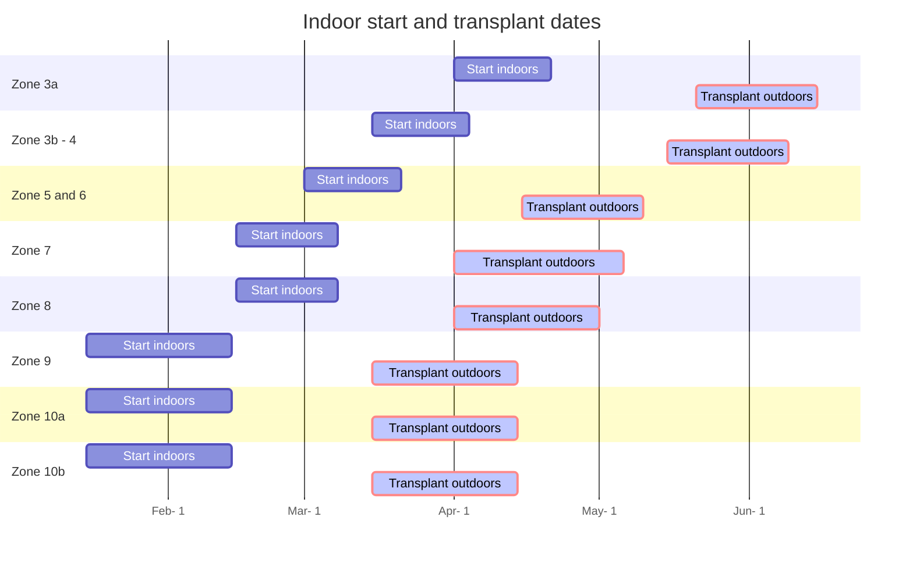

---
# Title, summary, and page position.
linktitle: Tomatoes 🍅
summary: Guide for growing tomatoes in the backyard.
icon: #book
icon_pack: fas
show_date: true
share: true
# Page metadata.
title: Tomato growing guide 🍅
date: '2018-09-09T00:00:00Z'
type: book # Do not modify.
lastmod: '2024-2-10'

---


-----

#### 📣 At a glance


```markmap {height="300px"}
- 🍅**Tomato plants**
  - 🌞 **Sun** Full 
  - 🌧️ **Water** Every other day, if leaves
      are wilting = add water
  - 🥫 **Fertilize** Weekly with 20-20-20 at 
          ~150-200 ppm at full size, or utilize fertilizer 
          calculator below 
  - 🧪 **PH** 6.2 to 6.8
  - 📏 **Spacing** 1.5 - 2 Feet apart per plant
  - 🧹 **Maintenance** Every few days, clear 
          weeds, prune suckers

```

---

## Introduction

{}
Tomatoes are one of my favorite plants to grow. Depending on the type of tomato plant, each plant may produce anywhere from 20-35 lbs of tomatoes per plant annually. There are many types to consider. The following are brief list of common tomato types that I have grown:

- **cherry tomatoes**: perfect for snacking, makes salad prep quick and easy
- **san marzanos**: excellent for tomato sauces for pasta dishes and pizza. They have a mild and sweet flavor
- **big beef tomatoes**: perfect for burgers, bacon lettuce tomato (BLT) sandwiches, salsa, caprese salad. Provides a firm texture with crisp and flavor.
- **sakura tomatoes**: all around medium size tomatoes for many different uses


Tomatoes can also be Indeterminate  or Determinate.
- **Indeterminate tomatoes** continue to grow while producing fruit.
- **Determinate tomatoes** grows all fruit at a given time and ripens all together. The plant is typically finished afterwards.

Check the section NJ Zone 7 Seed link on the right regarding typical tomato varieties that grow well in NJ. I will update when I can locate similar lists for other zones. 
{}


---
## 🏁 Starting

First step is to determine your Zone. [Click here to access the zone map 🗺](/docs/zones/) or on the left to get your zone information. The dates below are  guidelines as to when the best time of year to start the tomato seeds. If they are started too early indoors, may not have enough space and light output to continue the growth of tomato plants in larger containers. If starting too late, may not have enough time to obtain successful yields or the young plants may not manage well under the hot summer sun.  


### Start dates





### Sizing
Tomato seeds should be started in 50 count trays. A tray is roughly about  21¼" x 11¼" x 2¼" or 19.6" x 9.75". Each cell within in the tray has dimensions: 1¾" x 1¾-2.72". This will provide each tomato seedling with ~4-6 weeks of growth. Larger size containers like egg cartons, small plastic cups can also be used, however the larger the starting container, the potential waste of space/soil if something were to go wrong. Also, try not to plant tomato seeds in smaller containers. They will out grow the space quickly which would requiring transferring the young seedlings to larger size pots. More handling of the young fragile seedlings = greater risk of damage, resulting in slow wilt, then eventual trip to the compost bin.

### Soil and seeding
Utilize potting soil that can be purchased from major retailers like lowes/home depot/walmart/aldis/target. The bagged soil should be labeled potting soil. Potting soil is most suitable for seed germination due to its drainage capacity. Bags labeled garden soil or dirt will not allow good drainage in containers. Water drainage in containers are required to prevent water stagnation. Stagnated water can eventually suffocate and rot plant roots.

Within each cell/container plant a single tomato seed. If you only have a few containers and many seeds,  go ahead and plant 2-3 seeds per small container. If/When all the seeds sprout, cut the extra seedlings and leave a single plant to continue to grow. 

During this stage, ensure the top soil area is kept moist. Use a spray bottle to water the top or gently pour water being carefully not to wash away the seeds and disrupt the soil. A plastic dome works well in keeping a moist environment.

A heating mat is  recommended. Temperatures around 75-80 helps with speeding up germination, otherwise temps in the 60s will prolong it. Light is also not as important for germination at this stage. However, a strong light source IS required as soon as the seeds sprout. Without a suitable light source that provides what plants require, will result in leggy stretched seedlings. From my experience, leggy/stretched seedlings eventually tip over and wither. 





{}

During this stage, not much excitement. I typically check the soil moisture first thing in the morning and again in the evening. If its a little dry, I use the misting bottle to reapply water. Sprouting can happen within a week or less. 

{}


-----
## Seedling stage
When the plant first emerges from seed, the first leaves are called 'false' leaves known as Cotyledons.  The picture below is about 10 days from initial planting of the tomato seed: 




The young plant will continue to grow until 'true' leaves appear. See below of tomato true leaves appearing after 8 days:





During this time, it is recommended to provide 14-16 hours of light. Keep with watering such that soil is moist and not overly saturated and  fertilize after ~2 weeks. 50 PPM of general fertilizer 20-20-20 once a week.

---

## Transferring and Maintenance

 ❄️ ⛄ Before transplanting, ensure the dangers of **frost** are over and temperatures are consistently around 60 F degrees or higher. ⛄  ❄️

After about a month of growth, the tomato plants will begin to look as pictured below. I simply kept with fertilizing, exposure to lights, and watering. At this stage, tomatoes may be prepped for transfer into the ground. 





{}
 If for some reason, planting needs to be delayed due to busy schedule, temperatures are colder than expected, raining for weeks, etc... the young plants can be transferred to larger pots for more growth and time.  

Below is a picture of tomato plants transferred to 4 inch pots. It was a cold/rainy spring in 2023 zone 7.



{}


💡 Prior to transferring the tomato plants into the ground, ensure the tomato plants are acclimated to sun exposure for at least a few days. Plants can be placed under direct sunlight for 1-3 hours (start with less and gradually increase the time) and then returned under shade or back indoors. Pay attention to any changes. If the tomato plants are wilting, check the soil moisture and return to under shade. However, if there are no signs of stress after a few days, they can be transplanted.


Plants should be spaced 1.5-2 feet apart. This spacing ensures adequate air flow and space for the tomato plants to grow and produce. Continue to maintain watering and fertilizing.



### Fertilizing 💪

{}

I typically allow the tomato plants to grow for 5-6 months starting in April when they are transplanted. That is around 20-24 weeks of growth once they are in the ground. I divide the required fertilizer by the total weeks to get the weekly serving size. Fertilizing is real important for a healthy plants and consistent high quality tomatoes and yields.

{}


📚 <mark> **[According to Cornell University](http://nmsp.cals.cornell.edu/publications/files/VegetableGuidelines2019.pdf) the following rates are recommended for tomato plants:** </mark>

For Nitrogen (N), (100 lbs) per acre. 

 
For Phosphorus (P)

| if current P levels are (lbs /acre)  |< 3       | 3-5  | 6-12  | 13-39         | 40+ | 
| ----------- | --------- | ------- | ------ |        --------- | ----| 
| **add P lbs per acre**      | 200   | 150       | 100      | 50    | 20       | 0 |

For Potassium (K)

| if current K levels are (lbs /acre)  |< 50       | 50-99  | 100-199  | 200-299         | 300+ | 
| ----------- | --------- | ------- | ------ |        --------- | ----| 
| **add K lbs per acre**      | 240   | 180       | 120      | 60    | 0       | 0 |

Taking average values for P and K we can use N 100 P 100 K 120 per acre (aka 43560 square feet).

 <mark> **Scaled down to a 100 SF garden, the values are:** </mark>

 - 0.23 lbs Nitrogen, 
 - 0.23 lbs Phosphorus, 
 - 0.275 lbs of Potassium.


Now that we know the weight required of each NPK value, now determine the amount of fertilizer equivalent. 

📚 <mark> **Utilize this tool and input your fertilizer and  NPK values required (i.e. the table above) [https://aesl.ces.uga.edu/soil/fertcalc/](https://aesl.ces.uga.edu/soil/fertcalc/)** </mark> 


For example, calcium nitrate has an NPK rating of 15.5-0-0.

Therefore, to obtain 0.23 lbs of nitrogen for a 100 SF plot of tomatoes, one would require 1.5 lbs of calcium nitrate.

For 0.23 lbs of phosphorous, one can use superphosphate 0-18-0 at 1.3 lbs.

For 0.275 lbs potassium, one can use potash 0-0-60 at 0.3 lbs. 


With these values, the fertilizer can be applied weekly throughout the months. Simply divide the amount of fertilizer by the number of weeks the tomato plant may grow. To simplify measuring, convert lbs to grams...


1.5 lbs of calcium nitrate = ~680 grams. Therefore, over 12 weeks, you can apply 680/12 = 56 grams of calcium nitrate weekly to a 100 SF garden bed. For a potted tomato plant, ~0.5 grams of calcium nitrate. 


### In the ground

{}
Here are the tomato plants transplanted into the garden bed. Once the weather starts to warm above 80 degrees, growth rate increases and they really start to take off. Other than watering and the weekly fertilizing, take care of any weed growth that appears by the base of the plant and prune off any suckers (the stems that grow between the main branch and leaf branches). I will update the docs in the future to share with the trellising options I found worked best for my garden. 


{}



------
## Harvest 🍅

The first tomato harvest started middle of July (Zone 7b) when the green tomatoes started to turn red. Plants continued to grow and produce fruit until November. You can also harvest green tomatoes and allow them to rippen on your counter top. 

{}

Growing tomatoes at home are on another level compared to what is sold at   big box stores. They are crisp, flavorful, and colorful mainly because you can actually grow for quality! When produce is shipped from far away places, the tomato species are selected based on transportation and mold/disease resistance, with possibly flavor being the least important. What is your favorite species of tomato? Drop a comment!  


{}




## Notes 


### Gallery (coming soon)


### NJ Zone 7 seed list: 

A recommended list of tomatoes that grow well in NJ, provided by 
[Rutgers University](https://njaes.rutgers.edu/fs678/)

| Season      | Variety                                                                                 | Days to Maturity | Vine Type        | Disease Resistance | Fruit Size (oz.) |
| ----------- | --------------------------------------------------------------------------------------- | ---------------- | ---------------- | ------------------ | ---------------- |
| Early       | [Early Girl](https://njaes.rutgers.edu/tomato-varieties/variety.php?Early+Girl)         | 50               | Indeterminate    | V,F                | 4                |
|             | [Early Goliath](https://njaes.rutgers.edu/tomato-varieties/variety.php?Early+Goliath)   | 58               | Semi-determinate | V,F,N              | 8                |
|             | [Fourth of July](https://njaes.rutgers.edu/tomato-varieties/variety.php?Fourth+of+July) | 49               | Indeterminate    | V,F,N,T            | 4                |
|             | [Moreton](https://njaes.rutgers.edu/tomato-varieties/variety.php?Moreton)               | 70               | Indeterminate    | V                  | 8                |
|             | Red Deuce                                                                               | 72               | Determinate      | V,F,T              | 10               |
|             | [Sunstart](https://njaes.rutgers.edu/tomato-varieties/variety.php?Sunstart)             | 66               | Determinate      | V,T                | 10               |
| Mid-Season  | [Better Boy](https://njaes.rutgers.edu/tomato-varieties/variety.php?Better+Boy)         | 75               | Indeterminate    | V,F,N              | 12               |
|             | [BHN 589](https://njaes.rutgers.edu/tomato-varieties/variety.php?BHN+589)               | 75               | Determinate      | V,F,TMV            | 7                |
|             | [Big Beef](https://njaes.rutgers.edu/tomato-varieties/variety.php?Big+Beef)             | 70               | Indeterminate    | V,F,N,TMV          | 10               |
|             | [Big Boy](https://njaes.rutgers.edu/tomato-varieties/variety.php?Big+Boy)               | 78               | Indeterminate    |                    | 16               |
|             | [Celebrity](https://njaes.rutgers.edu/tomato-varieties/variety.php?Celebrity)           | 72               | Semi-determinate | V,F,N,T            | 10               |
|             | [Jet Star](https://njaes.rutgers.edu/tomato-varieties/variety.php?Jet+Star)             | 72               | Indeterminate    | V,F                | 10               |
|             | [Mountain Magic](https://njaes.rutgers.edu/tomato-varieties/variety.php?Mountain+Magic) | 66               | Indeterminate    | V,F,EB             | 2                |
|             | [Red Defender](https://njaes.rutgers.edu/tomato-varieties/variety.php?Red+Defender)     | 75               | Determinate      | V,F,T              | 8                |
|             | [Rutgers 250](https://njaes.rutgers.edu/tomato-varieties/variety.php?Rutgers+250)       | 74               | Semi-determinate |                    | 10               |
|             | [Scarlet Red](https://njaes.rutgers.edu/tomato-varieties/variety.php?Scarlet+Red)       | 73               | Determinate      | V,F                | 12               |
|             | [Sunbrite](https://njaes.rutgers.edu/tomato-varieties/variety.php?Sunbrite)             | 75               | Determinate      | V,F                | 10               |
| Late Season | [Ramapo](https://njaes.rutgers.edu/tomato-varieties/variety.php?Ramapo)                 | 85               | Indeterminate    | V,F                | 12               |


## References
- [Tomato yield Mississippi State University ](http://extension.msstate.edu/content/how-much-yield-can-i-expect-plant)
- [Cornell University 2019 fertilization](http://nmsp.cals.cornell.edu/publications/files/VegetableGuidelines2019.pdf) 
- [Univerisity Rutgers Tomato List](https://njaes.rutgers.edu/fs678/)


