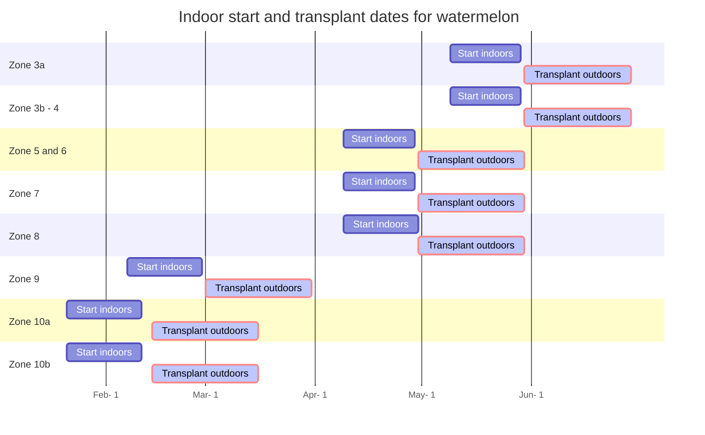

---
# Title, summary, and page position.
title: Watermelon 🍉 
summary: Guide for growing watermelon in the backyard.
show_date: true
share: true
date: '2018-09-09T00:00:00Z'
lastmod: '2024-02-06'
tags: [vegetables]
---


#### 📣 At a glance

```markmap {height="300px"}
- 🍉**Watermelon plants**
  - 🌞 **Sun** Full 
  - 🌧️ **Water** Every other day, if leaves
      are wilting = add water
  - 🥫 **Fertilize** Weekly 20-20-20 at 
          ~200 to 400 ppm or 33.5g, 9g, 8g
          (calc nitrate, triple super phosphate, potash)
          per 100 SF 
  - 🧪 **PH** 6.0 to 6.5
  - 📏 **Spacing** 3 Feet minimum between watermelon plants
  - 🧹 **Maintenance** harvest watermelon at picking 
        size and tendril dried. Expect 2-3 melons per plant.

```

---

## Introduction
{}

Watermelons... I dream about. It's my favorite fruit I have grown that has shocked me as to how different fresh from the backyard vs anything bought locally. The taste reminds of watermelon in the early 80s. Crisp, sweet, plenty of flavor, and juicy. Each bite, at least for me, taste like pure energy... like all the cells in my body are having party lol. Cutting into to one, pops with pressure.   


This guide will provide an overview of how to grow watermelons.
{}


---

## 🏁 Starting

First step is to determine your Zone. [Click here to access the zone map 🗺](/docs/zones/) or on the left to get your zone information. The dates below are  guidelines as to when the best time of year to start the cucumber seeds. If they are started too early indoors, may not have enough space and light output to continue the growth of watermelon plants in larger containers. If starting too late, may not have enough time to obtain successful yields or the young plants may not manage well under the hot summer sun.  


### Start dates




### Sizing
Watermelon seeds should be started in 32 or 50 count trays. A tray is roughly about  21¼" x 11¼" x 2¼" or 19.6" x 9.75". Each cell within this tray has dimensions: 1¾" x 1¾-2.72". 32 inch size tray are typically around 2" inch square. This will provide each watermelon seedling with ~3-4 weeks of growth. Also, try not to plant Watermelon seeds in smaller containers. They will out grow the space quickly which would requiring transferring the young seedlings to larger size pots. More handling of the young fragile seedlings = greater risk of damage, resulting in slow wilt, then eventual trip to the compost bin.


### Soil and seeding
Utilize potting soil that can be purchased from major retailers like lowes/home depot/walmart/aldis/target. The bagged soil should be labeled potting soil. Potting soil is most suitable for seed germination due to its drainage capacity. Bags labeled garden soil or dirt will not allow good drainage in containers. Water drainage in containers are required to prevent water stagnation. Stagnated water can eventually suffocate and rot plant roots.

Within each cell/container plant a single cucumber seed. If you only have a few containers and many seeds,  go ahead and plant 2 seeds per small container. If/When all the seeds sprout, cut the extra weaker looking seedling and leave a single plant to continue to grow. 

During this stage, ensure the top soil area is kept moist. Use a spray bottle to water the top or gently pour water being careful not to wash away the seeds and disrupt the soil. A plastic dome works well in keeping a moist environment.

A heating mat is recommended. Temperatures around 75-80 helps with speeding up germination, otherwise lower temps in the 60s will prolong it. Light is also not as important for germination at this stage. However, a strong light source IS required as soon as the seeds sprout. Without a suitable light source that provides what plants require, will result in leggy stretched seedlings. From my experience, leggy/stretched seedlings eventually tip over and wither. 





{}

During this stage, not much excitement. I typically check the soil moisture first thing in the morning and again in the evening. If its a little dry, I use the misting bottle to reapply water. Sprouting can happen within a week or less using a heat mat. 

{}


-----
## Seedling stage
When the plant first emerges from seed, the first leaves are called 'false' leaves known as Cotyledons.  The picture below is about 18 days from initial planting of the cucumber seed: 




The young plant will continue to grow and produce 'true' leaves. See below of true leaves of watermelon plants. The is how fast they can grow after ~3 weeks:





During this time, it is recommended to provide 14-16 hours of light. Keep with watering via bottom tray such that soil is moist and not overly saturated. If watering with no bottom access, simply pour water carefully without disturbing the soil. Fertilize at this stage by applying 50 PPM of general fertilizer 20-20-20 once a week [^1]

---


## Transferring and Maintenance

❄️ ⛄ Before transplanting, ensure the dangers of **frost** are over and temperatures are consistently above 60 F degrees or higher. The warmer the better. According to research, transplanting seeds below 60 degrees slows growth. ⛄  ❄️

After about a month of growth, the watermelon plants will begin to look as pictured below. I simply kept with fertilizing, exposure to lights, and watering. At this stage, watermelon plant may be prepped for transfer into the ground. 





{}
 If for some reason, planting needs to be delayed due to busy schedule, temperatures are colder than expected, raining for weeks, etc... the young plants can be transferred to larger pots for more growth and time.  The picture above are the watermelon plants transferred to 4 inch pot containers.


{}

 

💡 Prior to transferring the watermelon plants into the ground, ensure the watermelon plants are acclimated to sun exposure for at least a few days. Plants can be placed under direct sunlight for 1-3 hours (start with less and gradually increase the time) and then returned under shade. Pay attention to any changes. If the cucumber plants are wilting, check the soil moisture and return to under shade. However, if there are no signs of stress after a few days, they can be transplanted.



Plants should be spaced 3 feet apart. This spacing ensures adequate air flow and space for the watermelon plants to grow outward and produce. Continue to maintain watering and fertilizing. Watermelon plants spread like vines all over the ground. The picture below was taken 5/21/23. _**note** how the watermelon plants seem smaller relative to the others. I believe this may be caused by the spring temps being < ideal 60s_.



### Fertilizing 💪

{}

I typically allow the watermelon plants to grow for 5-6 months starting in April when they are transplanted. That is around 20-24 weeks of growth once they are in the ground. I divide the required fertilizer by the total weeks to get the weekly serving size. Fertilizing is real important for a healthy plants and high quality watermelon and yields.

{}


📚 <mark> **[According to Cornell University](http://nmsp.cals.cornell.edu/publications/files/VegetableGuidelines2019.pdf) the following rates are recommended for cucumber plants [^1]:** </mark> 


* For Nitrogen (N), (100 lbs) per acre. 

 
For Phosphorus (P)

| if current P levels are (lbs /acre)  |< 3       | 3-5  | 6-12  | 13-39         | 40+ | 
| ----------- | --------- | ------- | ------ |        --------- | ----| 
| **add P lbs per acre**      | 160   | 120       | 80      | 40    | 20       | 0 |

For Potassium (K)

| if current K levels are (lbs /acre)  |< 50       | 50-99  | 100-199  | 200-299         | 300+ | 
| ----------- | --------- | ------- | ------ |        --------- | ----| 
| **add K lbs per acre**      | 160   | 120       | 80      | 40    | 0       | 0 |


Taking average values for P and K we can use, per acre (i.e. 43560 square feet).: 
* N 100 lbs
* P 80 lbs
* K 80 lbs


Now that we know the weight in lbs required of each NPK value, next is to determine the amount of fertilizer equivalent. 

📚 <mark> **Utilize this tool and input your fertilizer and  NPK values required (i.e. the table above) [https://aesl.ces.uga.edu/soil/fertcalc/](https://aesl.ces.uga.edu/soil/fertcalc/)** </mark> 





The required fertilizers for 1 acre are now listed below:

* 667 lbs of 15-0-0 calcium nitrate
* 174 lbs of 0-46-0 triple super phosphate 
* 160 lbs of 0-0-50 potash

Lets now convert lbs to grams to allow for easier division of square feet:
* 302546 grams of 15-0-0 calcium nitrate
* 78925 grams of 0-46-0 triple super phosphate 
* 72574 grams of 0-0-50 potash

Now convert to square feet by dividing the grams by 43560 

* 6.7 grams of 15-0-0 calcium nitrate
* 1.8 grams of 0-46-0 triple super phosphate 
* 1.6 grams of 0-0-50 potash

In other words, for a 100 sf garden, **total** fertilizer required for the **lifespan** of the plants are:
* 670 grams of 15-0-0 calcium nitrate
* 180 grams of 0-46-0 triple super phosphate 
* 160 grams of 0-0-50 potash


With these values, we can now determine the weekly serving size by dividing the amount of fertilizer by the number of weeks the plant may grow. 

 <mark> **Over 20 weeks, you can apply the following weekly for a 100 SF garden of watermelon**  </mark>
* 670/20 = 33.5 grams of calcium nitrate weekly 
* 180/20 = 9 grams of triple super phosphate 
* 160/20 = 8 grams of potash

These fertilizers can simply be placed near the stem of each plant. As they get watered, the fertilizer will break down and make its way down to the roots.[^2]. 


### In the ground

{}
Here are the watermelon plants growing in the garden bed. Once the weather starts to warm above 80 degrees, growth rate increases and they really start to take off. Other than watering and the weekly fertilizing, watermelon plants are a low maintenance. Eventually you will see 2-3 baby watermelons per plant. Size starts off looking like a little  golf ball. 











{}


------
## Harvest 🍉


> 📖 **tidbit:** both seeds and paintings of watermelon have been discovered in Egyptian tombs more than 4,000 years old. [^3]

Hopefully you have gotten this far and can enjoy the fruits of labor!  The first watermelon harvest started at the end of July (Zone 7b). Watermelon can be harvested once they reach the desired size and when the tendril has dried. The tendril is located opposite of where the watermelon is connected on the vine. A dried tendril will be completely dried and brown.  I will update this post later this year with a photo of the tendril. To harvest, simply cut the melon off from the vine. 

⚠️ _Careful when accessing the watermelon so as not to crush the vines or accidentally detach another growing watermelon._

{}
Growing 🍉 watermelon was/is fairly low maintenance yet provide the most delicious treat! They are crisp, flavorful, juicy, and sweet. I was fortunate enough to harvest sugar babies multiple weeks and share them ice cold with family and friends.


If you have any questions, suggestions, or wanna say hello 👋, drop a comment or hit me up on tiktok/IG 


{}


## Notes 


## References
[^1]:[Cornell University 2019 fertilization](https://nmsp.cals.cornell.edu/publications/files/VegetableGuidelines2019.pdf) 
[^2]:[university missouri Watermelon ](https://extension.missouri.edu/publications/m173)
[^3]:[university missouri](https://ipm.missouri.edu/MEG/2020/7/watermelon-DT/)


